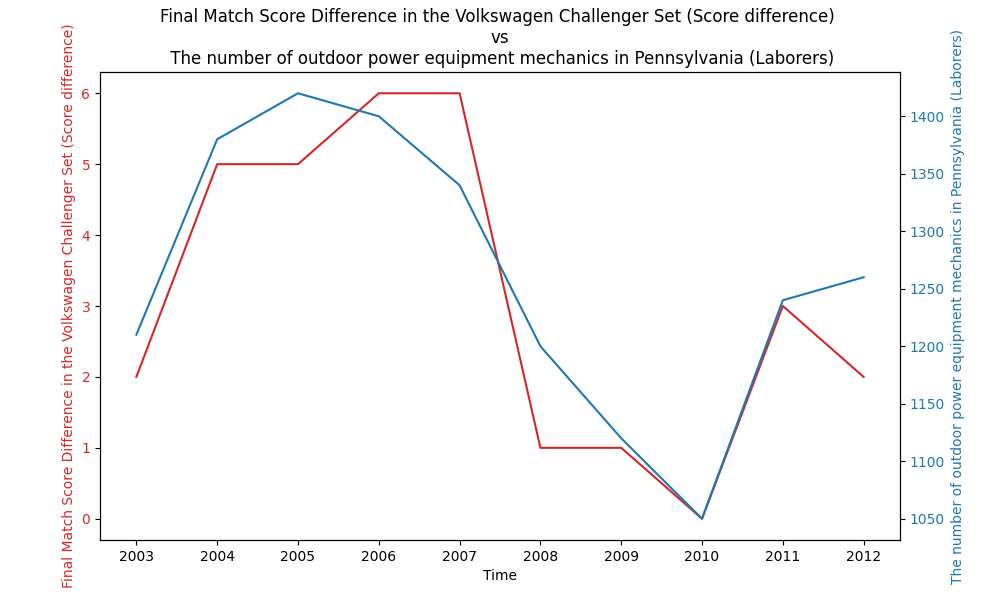

# Bizarre Correlations

This is a project to explore the concept of bizarre correlations. The idea is to find correlations between two variables that are not related at all. The project is based on the [Spurious Correlations](http://www.tylervigen.com/spurious-correlations) website.

Basic is a scraper that gets data from the [Spurious Correlations](http://www.tylervigen.com/spurious-correlations) website and saves i an key-value store.

Using the data, we can plot the correlation using matplotlib.


The date is saved using the id of the correlation as the key and the correlation as the value.
```json
{
   "2455":{
      "time":[
         "2003",
         "2004",
         "2005",
         "2006",
         "2007",
         "2008",
         "2009",
         "2010",
         "2011",
         "2012"
      ],
      "line1":{
         "label":"Final Match Score Difference in the Volkswagen Challenger Set (Score difference)",
         "data":[
            "2",
            "5",
            "5",
            "6",
            "6",
            "1",
            "1",
            "0",
            "3",
            "2"
         ]
      },
      "line2":{
         "label":"The number of outdoor power equipment mechanics in Pennsylvania (Laborers)",
         "data":[
            "1210",
            "1380",
            "1420",
            "1400",
            "1340",
            "1200",
            "1120",
            "1050",
            "1240",
            "1260"
         ]
      }
   }
}
```


## Requirements
- Python 3.12
- Poetry

## Installation
```shell
poetry install
```